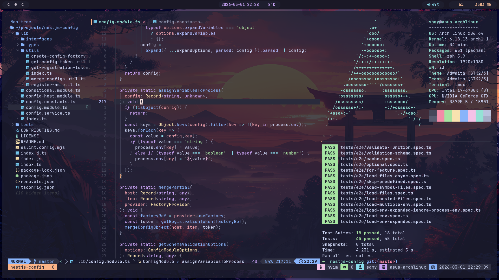

# dotfiles



## Installation

```sh
# Install GNU Stow
sudo pacman -S stow

# Clone this repository
git clone --recursive https://github.com/foxadb/dotfiles.git $HOME/dotfiles

# Stow the wanted modules
cd $HOME/.dotfiles
stow alacritty
stow i3
stow nvim
```
